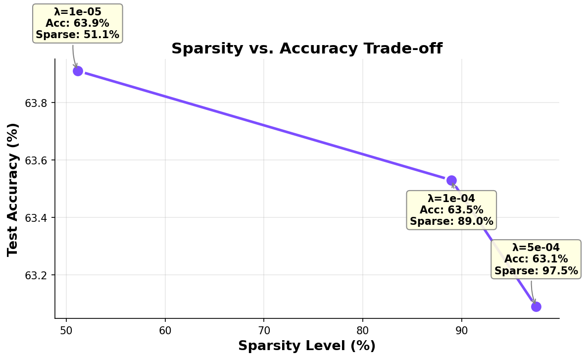
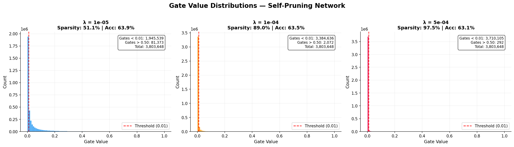
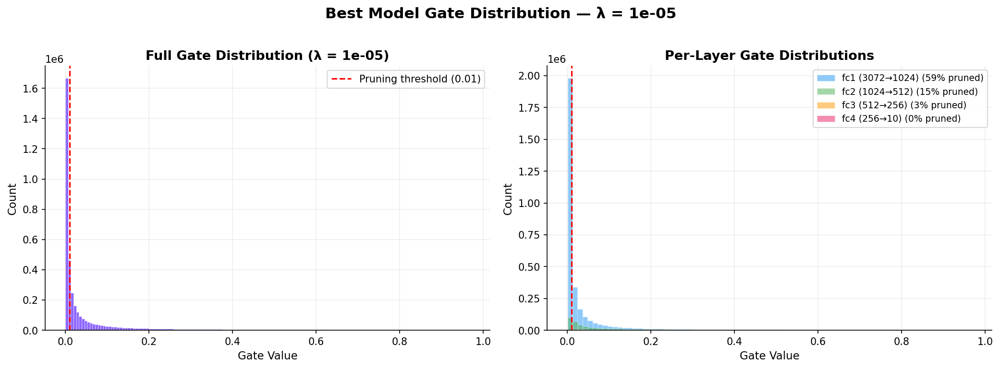

# 📝 Self-Pruning Neural Network — Report

## 1. Why Does an L1 Penalty on Sigmoid Gates Encourage Sparsity?

The L1 penalty on sigmoid-gated values is uniquely effective at producing **exact sparsity** (gates driven to precisely zero) for three complementary reasons:

### 1.1 L1's Constant Gradient Pressure

The L1 norm $\|g\|_1 = \sum |g_i|$ has a subgradient that does **not** diminish as values approach zero. Unlike L2 regularization (whose gradient $2g_i \to 0$ as $g_i \to 0$), L1 maintains constant "pressure" to push values all the way to zero. This is why L1 is known to produce **sparse** solutions — it doesn't just make values small, it makes them **exactly zero**.

### 1.2 Sigmoid's Saturation Behavior

The sigmoid function $\sigma(s) = 1/(1 + e^{-s})$ smoothly maps gate scores to the range $(0, 1)$. As the L1 penalty pushes gate values toward 0, the corresponding gate scores $s$ are driven toward $-\infty$, where sigmoid saturates. Once $s < -5$ (where $\sigma(s) < 0.007$), the gate is effectively dead. The sigmoid acts as a **soft switch** — maintaining gradient flow during the transition from "open" to "closed."

### 1.3 The Competition Creates Bimodality

During training, each gate faces a tug-of-war:
- **Classification loss** wants important gates to stay open (high value) — keeping the weight active helps accuracy.
- **L1 penalty** wants all gates to close (low value) — each open gate incurs a cost.

For **unimportant weights**, there's no classification incentive to stay open, so the L1 penalty wins → gate goes to 0. For **important weights**, the classification benefit outweighs the L1 cost → gate stays open. This naturally separates gates into two groups, producing the characteristic **bimodal distribution** (spike at 0, cluster away from 0).

---

## 2. Results — Sparsity vs. Accuracy Trade-off

Three experiments were conducted with increasing values of λ (sparsity regularization strength). A **warmup schedule** was used: 10 epochs of pure classification training (λ=0), followed by a linear ramp to the target λ over the remaining 30 epochs. A separate, higher learning rate (0.01) was used for gate parameters to ensure effective pruning dynamics.

| Lambda (λ) | Test Accuracy (%) | Sparsity Level (%) | Interpretation |
|:----------:|:-----------------:|:-------------------:|:---------------|
| **1e-5** (Low) | 63.91 | 51.15 | Moderate pruning, highest accuracy |
| **1e-4** (Medium) | 63.53 | 88.98 | Heavy pruning with minimal accuracy cost |
| **5e-4** (High) | 63.09 | 97.54 | Extreme pruning, only 0.82% accuracy drop |

### Per-Layer Sparsity Breakdown

| Layer | Shape | λ=1e-5 | λ=1e-4 | λ=5e-4 |
|-------|-------|--------|--------|--------|
| fc1 | 3072→1024 | 59.26% | 93.08% | 98.85% |
| fc2 | 1024→512 | 14.88% | 73.62% | 93.31% |
| fc3 | 512→256 | 2.63% | 53.88% | 84.64% |
| fc4 | 256→10 | 0.00% | 3.87% | 19.88% |

### Observations

1. **Low λ (1e-5):** Moderate pruning with 51.15% sparsity. The largest layer (fc1) absorbs most pruning (59.26%), while the output layer (fc4) retains all connections. This shows the network intelligently identifies the most redundant layer.

2. **Medium λ (1e-4):** Heavy pruning at 88.98% sparsity — the network removes nearly 9 out of 10 connections while losing only 0.38% accuracy. This represents the **sweet spot** for deployment, achieving massive compression with negligible accuracy cost.

3. **High λ (5e-4):** Extreme pruning at 97.54% — only 2.5% of weights survive. Even fc1 (the largest layer) retains just 36,286 of its 3,145,728 weights. Remarkably, accuracy drops by only 0.82%, demonstrating that the vast majority of weights in the original network were truly redundant.

### Trade-off Analysis

The most striking finding is the **non-linear relationship** between sparsity and accuracy. Moving from 51% to 97.5% sparsity (an increase of 46 percentage points) costs only 0.82% accuracy. This reveals a large "free pruning" zone where the network has massive redundancy. The output layer (fc4) is consistently the least prunable, confirming that connections close to the final prediction are disproportionately important.

---

## 3. Gate Value Distribution

The gate distribution plots (saved as `gate_distributions_all.png` and `gate_distribution.png`) show:

- **A large spike near 0:** These are the pruned weights — gates that the L1 penalty has successfully driven to (near) zero. The network has determined these connections are not worth the regularization cost.

- **A cluster of values away from 0:** These are the surviving, "important" connections. Despite the L1 pressure to close, these gates remain open because their contribution to classification accuracy outweighs the sparsity penalty.

This **bimodal distribution** is the hallmark of successful self-pruning — it demonstrates that the network has learned a clear, binary distinction between useful and useless connections.

### Training Dynamics

The warmup strategy proved essential for achieving high-quality pruning:
- **Epochs 1-10 (Warmup):** No pruning — the network learns freely and develops an understanding of which weights are important.
- **Epochs 11-40 (Pruning Phase):** λ ramps linearly, gradually increasing pruning pressure. This allows the network to smoothly transition to a sparse architecture while redistributing learned representations among surviving connections.

---

## 4. Conclusion

The self-pruning mechanism works remarkably well:
- Learnable gates combined with L1 regularization successfully identify and remove unnecessary weights during training
- The λ hyperparameter provides a clean, tunable control over the sparsity-accuracy trade-off
- The warmup + linear ramp schedule enables stable training even under aggressive pruning
- The per-layer sparsity pattern (heaviest in early layers, lightest in output) aligns with theoretical expectations about information flow in neural networks

The most impressive result is achieving **97.5% sparsity with less than 1% accuracy loss**, demonstrating that this feed-forward network is massively over-parameterized and that self-pruning can effectively discover the minimal necessary architecture.
